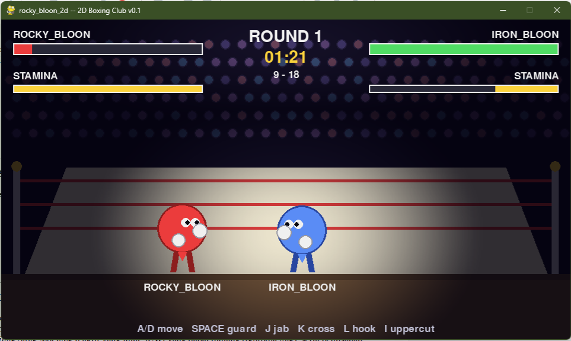

# rocky_bloon — Rocky Bloon: 2D World Champion Boxing Club (v0.1)



                   A/D move | SPACE guard | J/K/L/I attack
A 2D boxing game/simulation inspired by old-school Nintendo-era arcade boxing.

You control **ROCKY_BLOON**; the opponent **IRON_BLOON** is a rule-based, deterministic FSM AI.

Python 3 + Pygame + standard library only. No NumPy, no external assets, no audio files — all sounds are synthesized procedurally at startup.

## Honest scope statement

- **Audio**: procedural arcade SFX (whooshes / thumps / bell / crowd), presentation-only. NOT realistic boxing audio.
- **Lighting**: a precomputed 2D illumination mask — a game lighting trick, NOT physical illumination.
- **Hit detection**: 1D distance-based + seeded accuracy roll, NOT biomechanics.
- **AI**: rule-based finite state machine with personality parameters, NOT machine learning.
- **Physics**: intentionally simple (1D positions, push-apart bodies).
- **Determinism**: same seed + same simulation inputs are designed to produce the same simulation result. This claim covers the SIMULATION only — rendering and audio are presentation layers and are not part of any determinism claim. The GUI loop feeds fixed 1/60 s steps from accumulated real time, so frame rate never changes simulation step size; however interactive play is not replay-deterministic because human input arrives in real time. Headless auto-play (both fighters driven by Brains) is deterministic per seed.

## Install

```bash
python -m pip install pygame
```

## Run

```bash
python rocky_bloon.py
python rocky_bloon.py --seed 42
```

If audio cannot initialize (no sound card, headless server), the game still runs — `SfxBank` silently degrades to no-ops.

## Controls

| Key | Action |
|-----|--------|
| A / D (or ← / →) | move left / right |
| SPACE (hold) | guard |
| J / K / L / I | jab / cross / hook / uppercut |
| ENTER | start / rematch |
| ESC | quit |

## Headless (no window, no mixer, no rendering)

```bash
python rocky_bloon.py --headless --seed 123
```

From Python:

```python
from rocky_bloon import run_headless

m = run_headless(seed=123, rounds=3, quiet=True)
print(m.result, m.rocky.hp, m.iron.hp)
```

If audio can't initialize (headless server, no sound card), everything still runs — `SfxBank` silently degrades to no-ops.

## Architecture

```text
STATE (state.py)
      ↓
SIMULATION (sim.py)       ← never imports pygame
      ↓
AI (ai.py)
      ↓
VISUALIZATION (vis.py) + AUDIO (audio.py)  ← presentation layer
```

The simulation appends **structured events** (`attack_start`, `hit`, `miss`, `guard_hit`, `step`, `evade`, `knockdown`, `round_start`, `round_end`, `rise`, `result`, ...) to `match.events`.

Audio and visual consumers each keep a cursor index and react to every event **exactly once**: a swing whooshes once at attack start; an impact sounds once at hit resolution; footsteps are rate-limited sim-side (`STEP_INTERVAL`); the bell rings only on round transitions; knockdown fires thud + crowd once.

Presentation-side cooldowns (30 ms per sound name) can never change a simulation outcome — the simulation doesn't know audio exists.

**Timing**: the simulation advances in fixed 1/60-second steps; the graphical loop accumulates real time and feeds those fixed steps to the simulation. Rendering rate never determines the simulation timestep.

## Combat model

Attack lifecycle (no "press button → instant damage"):

```text
IDLE → STARTUP → ACTIVE (single hit check) → RECOVERY → IDLE
```

| Attack | Damage | Range | Stamina | Startup | Active | Recovery |
|--------|-------:|------:|--------:|--------:|-------:|---------:|
| JAB | 7 | 2.0 | 6 | 0.08s | 0.07s | 0.12s |
| CROSS | 11 | 2.3 | 10 | 0.14s | 0.08s | 0.22s |
| HOOK | 14 | 1.7 | 14 | 0.20s | 0.08s | 0.30s |
| UPPERCUT | 18 | 1.4 | 18 | 0.26s | 0.08s | 0.38s |

Hit resolution (once per swing, at end of ACTIVE):

1. **Range**: `dist <= range + 0.4 × body_radius`, else MISS.
2. **Accuracy roll** (seeded): accuracy − distance penalty − guard penalty + vulnerable bonus, scaled by stamina, clamped `[0.05, 0.97]`.
3. **Damage**:

   `base × (0.8+0.4·power) × U(0.9,1.1) × 1/(0.75+0.5·defense) × (0.6+0.4·stamina_factor) × U(0.85,1.15)`, min 1.0.

4. **Guarded**: ×0.25 chip + heavy stamina drain; big chips guard-break into a 0.6s STUN.
5. **Clean hit ≥ 14** → KNOCKDOWN (3s referee count, round clock paused, rises with ≥1 HP). 3 knockdowns in a round → TKO. HP ≤ 0 → KO.

**Stamina**: attacks cost up front; moving costs a trickle; regen 12/s idle, 7/s guarding. Below 30%: slower phases, weaker damage/movement. Below 4: cannot punch.

**Rounds**: 3 × 90s. Both start each round at 10; clean hit +1, knockdown −1. Higher total after final round wins by DECISION (tie → DRAW).

## Procedural audio (presentation-only)

`audio.py` synthesizes 13 SFX (JAB, CROSS, HOOK, UPPERCUT, PUNCH_MISS, HIT_LIGHT, HIT_HEAVY, GUARD_HIT, EVADE, STEP, BELL, KNOCKDOWN, CROWD_REACTION) from noise/sine recipes using only `wave`, `io`, `struct`, `math`, `random`, packs them into in-memory WAVs, and loads them into `pygame.mixer.Sound`.

Waveform randomness uses a dedicated `random.Random(0xB100)` — fully isolated from the simulation RNG.

## Spotlight lighting (game trick)

`vis.create_spotlight_mask()` runs ONCE at init: half resolution (480×270 ≈ 130k pixels), then smoothscaled to 960×540.

Two elliptical spots with normalized falloff:

```text
q = ((x-x0)/a)^2 + ((y-y0)/b)^2
I = max(0, 1-q)^p
overlay_alpha = (1-I) * 205
```

Per frame it's a single blit — no per-pixel math.

Render order:

```text
crowd/ring → darkening overlay → fighters → HUD → floating feedback
```

Crowd stays dark, ring and fighters are the focal point, HUD is never darkened.

## AI state machine

```text
knocked down           → RECOVER
stunned                 → STUNNED
stamina < 25%           → RETREAT (breathe)
opponent mid-swing      → counter_prob? ATTACK
                          else defense? GUARD
                          else EVADE
opponent vulnerable     → APPROACH / ATTACK
dist > preferred + 0.7  → APPROACH
dist < preferred − 0.5  → sometimes RETREAT
>>>>>>> c892c85a30de4ea77026105cb4945019cebb8f1d
```

Parameters: `aggression`, `defense`, `reaction`, `counter_probability`, `preferred_range`, `stamina_threshold`, `hurt_threshold`.

All decision randomness flows through `match.rng`.

## Tests

```bash
python tests.py
```

Covers: attack consumes stamina; tired can't attack; hit causes damage; blocked hit mitigates; out-of-range misses; stunned can't act; knockdown; knockdown recovery; KO; same seed → same result; different seeds → usually different; AI retreat/attack/guard; headless imports no pygame/vis; procedural WAV synthesis works without pygame.

Sound **quality** is not tested automatically — listen for yourself.

## Verification commands

```bash
python -m py_compile rocky_bloon.py state.py sim.py ai.py vis.py audio.py tests.py
python tests.py
python rocky_bloon.py --headless --seed 1
python rocky_bloon.py --headless --seed 123
python rocky_bloon.py --headless --seed 999
python rocky_bloon.py        # if a GUI is available
```

## v0.1 philosophy

This is deliberately small.

No 3D engine. No machine learning. No external audio assets. No giant framework.

Just state, simulation, rules, procedural feedback, and enough game logic to make two bloons punch each other.

**The balloon can be stupid. The architecture doesn't have to be.** 🥊🎈
